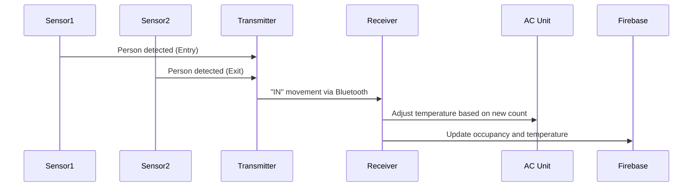
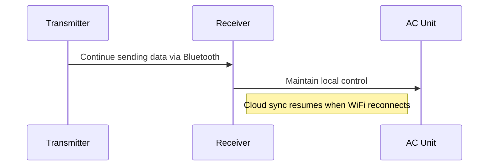
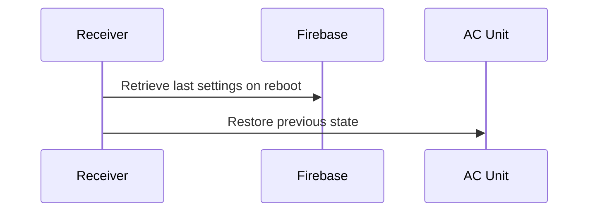

# Smart Energy Control System

An IoT-based solution for optimizing air conditioning usage through real-time occupancy tracking and environmental monitoring, contributing to energy conservation and green technology initiatives.

## Key Features

- **Real-time occupancy detection** using ultrasonic sensors
- **Dynamic temperature adjustment** based on occupancy and indoor/outdoor conditions
- **Cloud integration** with Firebase for remote monitoring
- **Energy savings** of 20-40% compared to conventional systems
- **Two versions available**: Wired and Wireless configurations

## System Versions

### Version 1: Single Board Device (Wired)

- All-in-one solution for Mitsubishi, Daikin, and Carrier AC units
- Wired ultrasonic sensor setup for occupancy detection
- Direct IR control of compatible AC units
- Includes:
  - ESP32 microcontroller
  - Dual ultrasonic sensors
  - DHT22 temperature/humidity sensors
  - IR transmitter
  - LCD display

### Version 2: Wireless System

- **Transmitter (Arduino-based)**:
  - HC-SR04 ultrasonic sensors for occupancy detection
  - DHT22 for environmental monitoring
  - HC-05 Bluetooth module for wireless communication
  - Runs `T_smartenergycontrol_MITS.ino`

- **Receiver (ESP32-based)**:
  - Processes data from transmitter
  - Controls AC unit via IR transmitter
  - Cloud connectivity via WiFi
  - Runs `R_smartenergycontrol_MITS.ino`

## Technical Specifications

| Component | Specification |
|-----------|--------------|
| Microcontroller | ESP32 (Receiver), Arduino (Transmitter) |
| Occupancy Sensors | HC-SR04 Ultrasonic (2 units) |
| Temperature Sensors | DHT22 (2 units) |
| Communication | WiFi 2.4GHz, Bluetooth 4.0 |
| Power Supply | 5V 2A |
| Dimensions | 120mm × 80mm × 30mm |

## Installation

### Hardware Setup
1. Mount ultrasonic sensors at entry/exit points (2-3m apart)
2. Place indoor temperature sensor in central location
3. Position outdoor temperature sensor in shaded area
4. Install IR transmitter facing AC unit
5. Connect power supply

### Software Configuration
1. Upload appropriate firmware:
   - Transmitter: `T_smartenergycontrol_MITS.ino` to Arduino
   - Receiver: `R_smartenergycontrol_MITS.ino` to ESP32
2. Configure WiFi credentials in receiver code
3. Set temperature thresholds and max capacity
4. Deploy web dashboard (optional)

## Web Dashboard

Access real-time system data and control parameters through our web interface:

Features:
- Real-time temperature and humidity monitoring
- Occupancy count visualization
- System status indicators
- Remote configuration of settings

## Working Scenarios

### Scenario 1: Room Occupancy Changes

### Scenario 2: WiFi Disconnection

### Scenario 3: Power Restoration

## Energy Savings Analysis

| Scenario | Daily Usage (kWh) | Monthly Savings |
|----------|------------------|----------------|
| Without System | 1.5 | - |
| With System | 0.9-1.2 | ₹33.30–₹61.20 |
| **Savings** | **20-40%** | **9-18 kWh** |

## Mathematical Model

The system uses an advanced algorithm to calculate optimal AC temperature:

\[ T = \min(\max((\frac{T_{min} + (\frac{C}{C_{max}})(T_{max} - T_{min}) + (\frac{T_{in}-5+T_{out}}{2}), T_{min}), T_{max}) \]

Where:
- \( T \) = Final AC temperature
- \( T_{in} \) = Inside temperature
- \( T_{out} \) = Outside temperature
- \( C \) = Current occupancy count
- \( C_{max} \) = Maximum capacity
- \( T_{min} \) = Minimum temperature limit
- \( T_{max} \) = Maximum temperature limit

## Project Documentation

For complete project details, please refer to:
- [Project Report](ProjectReport-IoTSmartEnergyControlSystem.pdf)

## License

This project is licensed under the MIT License - see the [LICENSE](LICENSE) file for details.

---

